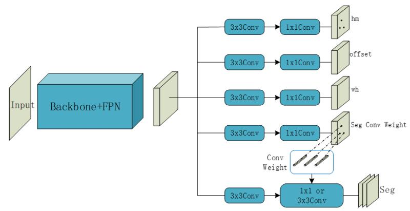
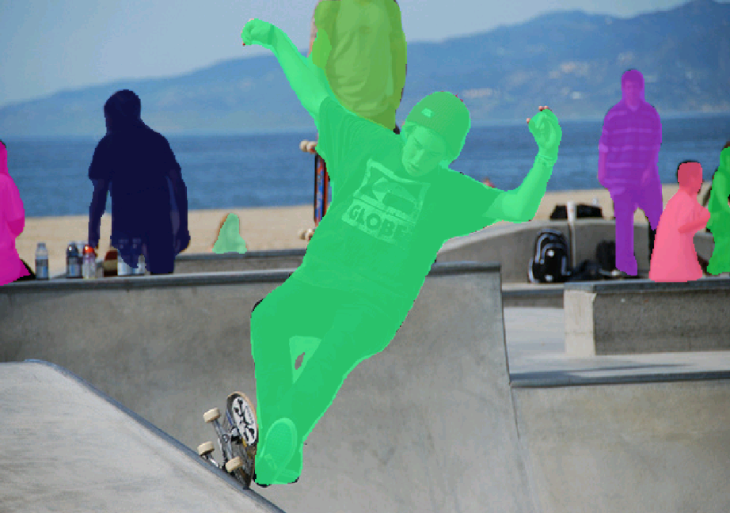
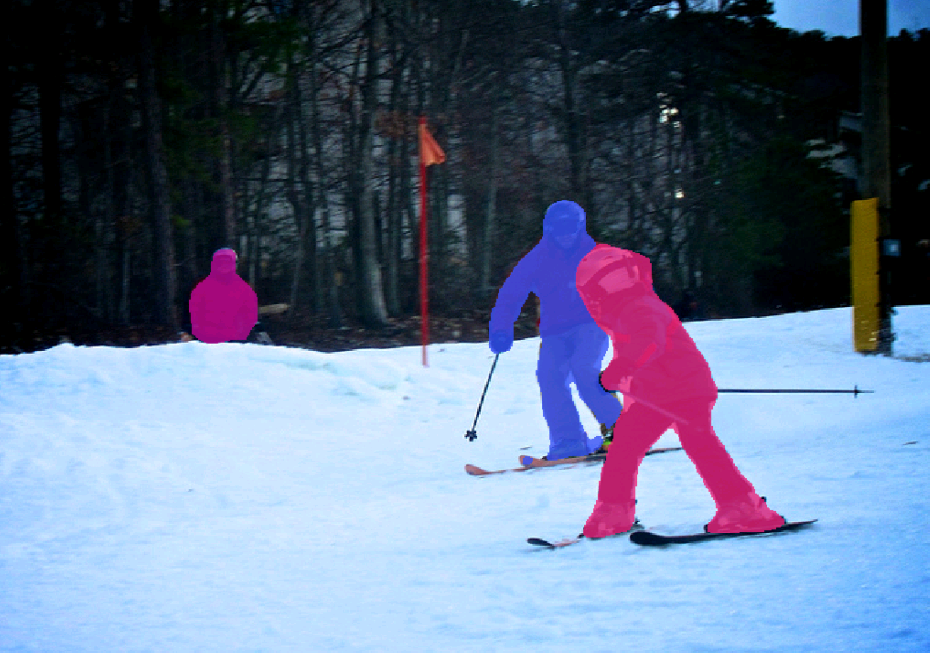
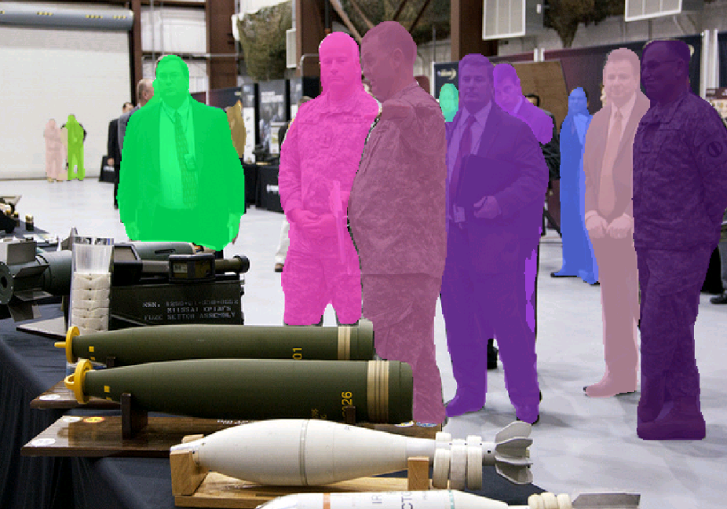
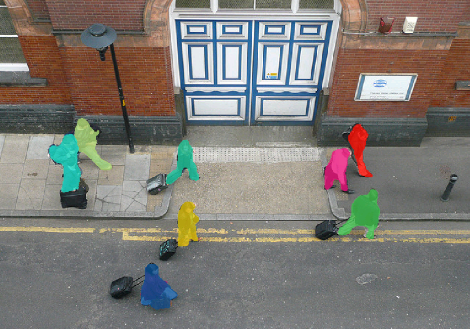
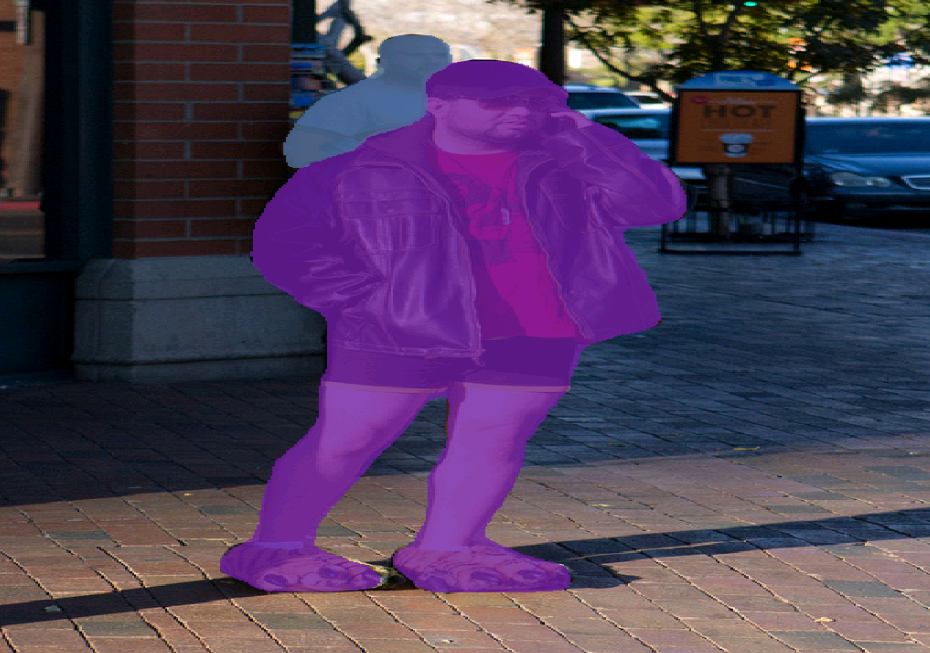

# Mask-CenterNet 
### This is an instance segmentation algorithm based on [CenterNet](https://github.com/xingyizhou/centernet). The code will be open soon.
### 基于yolact思想的new idea。
### 只支持训练和推理，还没实现测准确率。
### 显卡多的大兄弟可以试试，调调。
### 可以结合 [CenterNet](https://github.com/xingyizhou/centernet) 的代码进行训练。
### dla34收敛的比较快，可以快速看效果。
### 根据测试来看，本repo的实例分割方法可以与任意语义分割网络结合为实例分割网络。
### Net
* 
### demo
* 
* 
* 
* 
* 
* 
