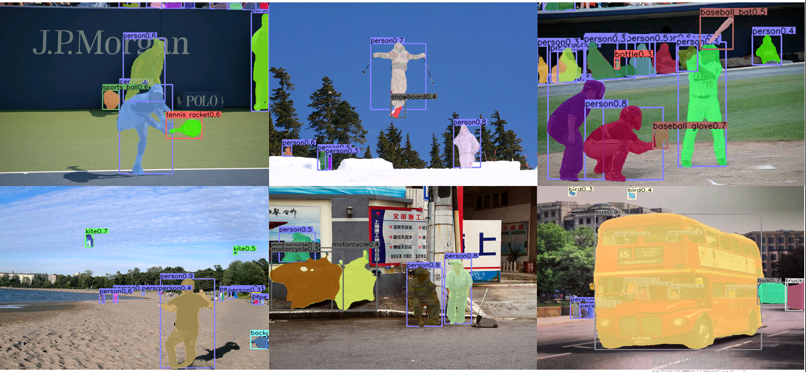

# CenterNet-CondInst
[CenterNet: Objects as Points](https://arxiv.org/abs/1904.07850) + [CondInst: Conditional Convolutions for Instance Segmentation](https://arxiv.org/abs/2003.05664) 

## Installation
Please refer to [CnterNet INSTALL.md](readme/INSTALL.md) for installation instructions.

## Training
```bash
## note : seg_weight default setting is 1. You can set it to other value to get better performance.
cd src
python main.py ctseg --exp_id coco_dla_1x --batch_size 20 --master_batch 9 --lr 1.25e-4 --gpus 0,1 --num_workers 4
```
## Eval
```bash
## not support flip test and multi scale test
cd src
python test.py ctseg --exp_id coco_dla_1x --keep_res --resume
```
## Visualization
```bash
cd src
python demo.py ctseg --exp_id coco_dla_1x --keep_res --resume --demo ../data/coco/val2017
```

## Result
| type| AP |  AP<sub>50</sub> | AP<sub>75</sub> | AP<sub>s</sub> | AP<sub>m</sub> | AP<sub>l</sub> | 
|-----|------|-----|-----|-----|-----|-----|
|box|0.358|0.540|0.384|0.154|0.391|0.535|
|mask|0.306|0.493|0.317|0.100|0.341|0.490|
backbone=dla_34, batch=32


## Reference
1. [CenterNet](https://github.com/xingyizhou/CenterNet)
2. [CondInst](https://github.com/Epiphqny/CondInst)